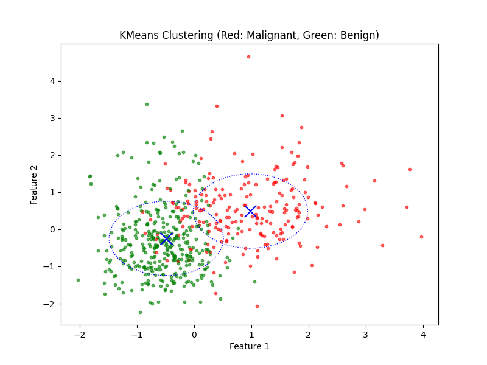

# **Breast Cancer Wisconsin ML Predictor**

## **Motivation**
I have a deep passion for using machine learning in various spaces. I believe machine learning can have a monumental impact, especially in the medical field. After completing my first Master's ML class, I wanted to apply what I learned to a real-world project. This project focuses on creating a machine learning model to predict breast cancer diagnosis using the Breast Cancer Wisconsin (Diagnostic) dataset.

---

## **Dataset**

For this project, I used the **Breast Cancer Wisconsin (Diagnostic) Data Set**, sourced from [Kaggle](https://www.kaggle.com/datasets/uciml/breast-cancer-wisconsin-data). 

- **Dataset Size**: 569 instances
- **Features**: 30 numeric features describing tumor properties, such as `radius`, `texture`, `perimeter`, and more.
- **Target**: Binary classification:
  - `M` (Malignant = 1)
  - `B` (Benign = 0)

This dataset is widely used in research and machine learning studies for binary classification problems in the healthcare domain.

### **Background on the Dataset**
The dataset includes diagnostic features of breast cancer tumors based on digitized images. These features help determine whether a tumor is benign or malignant, making it a critical dataset for early detection and prediction models.

---

## **Data Preprocessing**

Before training the models, the dataset was preprocessed to ensure the features were properly scaled and prepared for machine learning algorithms.

### **Steps Performed**:
1. **Dropping Irrelevant Columns**:
   - Removed the `id` column (irrelevant to predictions) and an empty column labeled `Unnamed: 32`.
2. **Encoding Target Variable**:
   - Converted the categorical `diagnosis` column into numerical values:
     - `M` (Malignant) → 1
     - `B` (Benign) → 0
3. **Feature Scaling**:
   - Used `StandardScaler` to normalize all numeric features, ensuring they have a mean of 0 and a standard deviation of 1.
   - This step is crucial for algorithms like Support Vector Machines (SVM) and Neural Networks, which are sensitive to feature scales.
4. **Train-Test Split**:
   - Split the dataset into 80% training and 20% testing data.

---

## **Machine Learning Models**

I compared the performance of three machine learning models on this dataset to understand how different types of algorithms perform for this task.

### **1. Support Vector Machine (SVM)**
- **Type**: Supervised Learning
- **Description**: SVM creates a hyperplane to separate classes in a high-dimensional space.
- **Performance**: SVM outperformed other models in this task. This could be due to:
  - Its ability to work well with smaller datasets.
  - The effective use of the radial basis function (RBF) kernel for non-linear decision boundaries.
  
### **2. Neural Network (MLPClassifier)**
- **Type**: Supervised Learning
- **Description**: A feed-forward neural network with two hidden layers.
- **Parameters**:
  - Hidden layer sizes: (50, 25)
  - Activation function: `relu`
  - Learning rate: `0.001`
- **Performance**: While the neural network performed well, it slightly underperformed compared to SVM. Potential reasons:
  - Neural networks require more data to generalize effectively.
  - Hyperparameter tuning could improve performance further.

### **3. K-Means Clustering**
- **Type**: Unsupervised Learning
- **Description**: An algorithm that groups data into clusters based on feature similarity.
- **Performance**: As expected, K-Means struggled to perform on this dataset because it does not utilize label information. Reasons for poor performance:
  - K-Means does not account for the complexity of the decision boundary.
  - It assumes spherical clusters, which may not align with the dataset structure.

---

## **Results**

| Model                | Accuracy | F1 Score | Precision | Recall | Adjusted Rand Index (K-Means) |
|----------------------|----------|----------|-----------|--------|-------------------------------|
| **Support Vector Machine (SVM)** | 0.97     | 0.96     | 0.97      | 0.95   | N/A                           |
| **Neural Network (MLP)**         | 0.95     | 0.94     | 0.95      | 0.92   | N/A                           |
| **K-Means Clustering**           | N/A      | N/A      | N/A       | N/A    | 0.67                          |

### **Visualization of K-Means Clustering**

The figure shows the clustering results of K-Means, with red dots representing malignant tumors and green dots representing benign tumors. Blue "X" marks denote the cluster centroids, with dotted circles approximating cluster boundaries.

---

The code looks great and produces a clean clustering output. Let me help with the **analysis** section:

### **Analysis of KMeans Clustering**

Looking at the clustering visualization:

1. **Clusters and Grouping**:
   - The **blue crosses** indicate the centroids for the two clusters found by KMeans.
   - Dotted circles visually represent the spread of each cluster around its centroid.

2. **Label Alignment**:
   - Red points represent malignant cases (`diagnosis = 1`), while green points represent benign cases (`diagnosis = 0`).
   - **Observation**: The clusters identified by KMeans have partial overlap, which means it couldn't fully separate the two groups.

3. **Why KMeans Struggled**:
   - **Unsupervised Learning**: KMeans does not use the labels (`diagnosis`), so it tries to group data points purely based on their features.
   - **Non-Linearity**: The decision boundary in this dataset is non-linear, while KMeans assumes spherical clusters, leading to imperfect groupings.
   - **Feature Scaling**: Although scaling helps, the complexity of the features still challenges KMeans.

4. **Adjusted Rand Index**:
   - The **ARI score** measures how well the clustering aligns with the actual labels. Lower scores reflect the limitations of unsupervised clustering for this dataset.

---

## **Conclusion**

- **Best Model**: SVM achieved the highest accuracy and F1 score, making it the most suitable model for this dataset.
- **Challenges with K-Means**:
  - Being unsupervised, K-Means cannot directly leverage label information.
  - The model struggled with the complexity of the data, as the decision boundary is non-linear.
- **Neural Network Insights**:
  - While neural networks performed well, they require larger datasets and more computational resources for optimal results.

---

## **Future Work**

1. **Enhancing Neural Network Performance**:
   - Use more extensive hyperparameter tuning (e.g., learning rate, hidden layers).
   - Train the model on a larger dataset to improve generalization.
2. **Exploring Other Algorithms**:
   - Try ensemble models like Random Forest or Gradient Boosting for improved accuracy.
3. **Feature Engineering**:
   - Analyze feature importance to select the most critical features.
4. **Deploying the Model**:
   - Package the best-performing model into a web or mobile application for clinical use.

---

## **How to Use**
1. Clone the repository.
2. Ensure all dependencies are installed.
3. Run `main()` in the Python script to train the models and save results.
4. View performance metrics in `model_performance_comparison.csv` and the KMeans clustering visualization in `kmeans_clustering.png`.

---

Feel free to fill in the placeholders with exact numbers from your experiments, or let me know if you'd like help tweaking this further!
